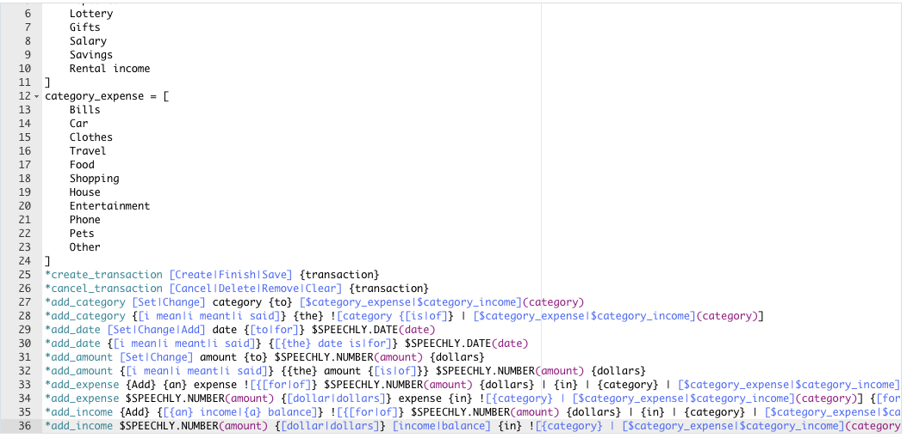

# slice.

### Description

slice. is an expense tracker that can be used to create budgets, track past/upcoming transactions, and clearly view budget status. The clean and simple design allows the user to focus on what matters the most, their budget. The awesome power of the Speechly API, which uses Machine Learning, allows the user to add/cancel transactions with their voice. The data is persistent across sessions allowing the user to keep track of transactions over a sustained period of time.  

## Technologies Used

React (Hooks, ES6), Context API, Speechly, Material UI, Local Storage

## Demo

